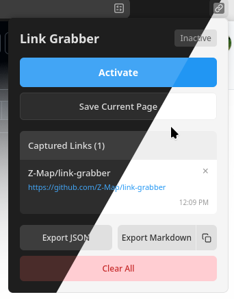

# Link Grabber

A browser extension that intercepts link clicks and stores them for later, instead of navigating to them immediately.



## Features

- Toggle link interception on/off per tab
- Grab links via right-click context menu
- View, open, or delete stored links in popup
- Export links as JSON or Markdown
- Copy links as Markdown to clipboard
- Persists links across browser sessions

## Installation

### Firefox (Recommended)
Download the latest release from the [Releases page](https://github.com/Z-Map/link-grabber/releases).

### Manual Installation
1. Build: `npm run build`
2. Go to `about:debugging`
3. Click "Load Temporary Add-on"
4. Select `manifest.json`

### Development
```bash
npm install
npm run lint   # lint the extension
npm run build # create .zip
```

## Usage

### Activating the Grabber

1. Click the extension icon to activate link grabbing for the current tab
2. While active, clicking any link captures it instead of navigating
3. Click again to deactivate

**Note:** Links to the same domain are ignored, allowing you to browse (e.g., YouTube, blogs) without deactivating the grabber. Links to external domains are captured.

### Single Actions

- Open the popup to view, open, or delete grabbed links
- Right-click any link and select "Grab Link" to capture it directly
- Use "Save Page" to capture the current page URL
- Export links as JSON or Markdown, or copy to clipboard
